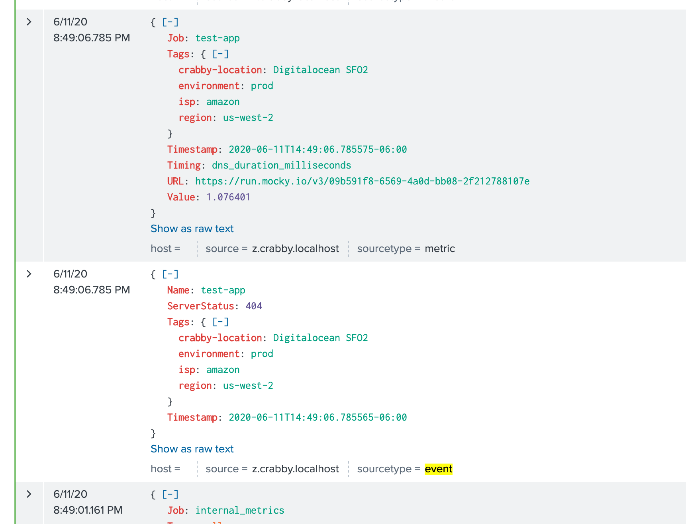
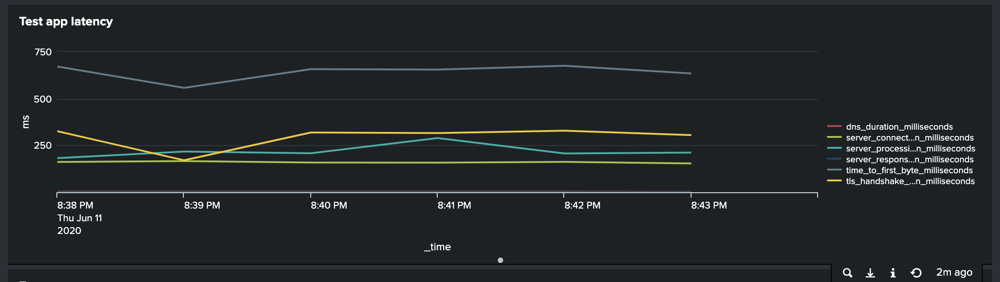
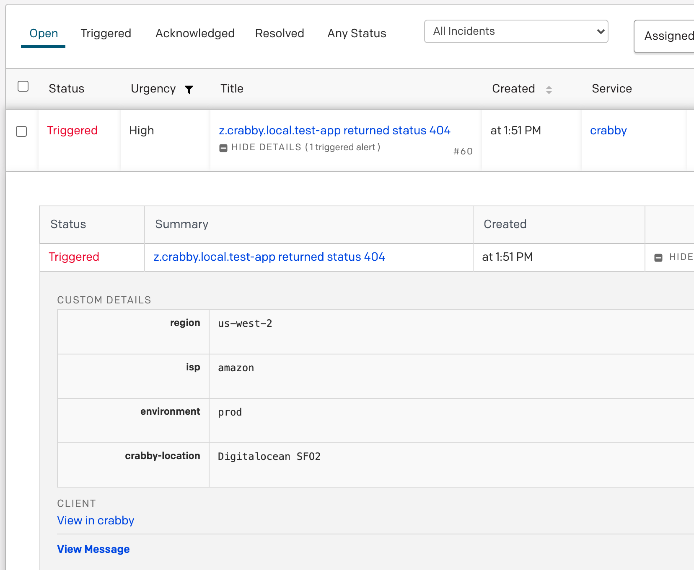

# crabby
**crabby** is a website performance tester that measures page load times and reports the measurements to a collection endpoint for processing, monitoring, and viewing.   Crabby can collect and report these metrics:

- DNS resolution time
- TCP connection time
- TLS negotiation time
- HTTP Response Code
- Remote server processing time
- Time to first byte (TTFB)
- Server response time
- DOM rendering time

Crabby currently supports five types of metrics delivery:

* Graphite - Time measurements as metrics using Carbon protocol over TCP or UDP
* Datadog API - Time measurements as metrics; HTTP response codes as service check
* Prometheus - Time measurements as metrics, made available through a Prometheus endpoint.
* Riemann - Time measurements as metric events; HTTP response codes as state events
* InfluxDB - Time measurements as metrics using the InfluxDB wire protocol over HTTP

# Two Types of Performance Measuring
Crabby has two types of probes for measuring website performance:
- **`simple`**, which uses Go's built-in client, `net/http`, to conduct simple HTTP `GET` requests.  These requests measure server performance metrics,including TLS negotiation time for HTTPS.  This probe fetches the full response for a URL but will **not** fetch objects reference by that page.  The `simple` probe is appropriate for measuring app/API availabililty, time-to-first-byte (TTFB), DNS lookups, and TCP connection time.  Being headless, it cannot measure DOM rendering time.  **If you only intend to run `simple` checks, you do not need to configure Selenium in your `config.yaml`.***

- **`selenium`**, which uses the Selenium API to conduct browser-based performance tests via Chrome/chromedriver.  The `selenium` test is appropriate when page render time measurement is the primary concern.  These tests will pull down the page along with all objects included in the page.  Due to limitations of chromedriver, the probe does not support reporting of TLS negotiation time or the HTTP response code.  Being browser-based, this probe has much higher resource (CPU, RAM) requirements than the `simple` probe and therefore, is not suggested for use on a typical cloud instance.  You'll need something closer to a desktop-class machine for this probe and even then, you may need to limit the number of pages that you test concurrently.

# Metrics Delivery
Crabby currently supports four protocols for metrics delivery: Graphite, Prometheus, Datadog, and Riemann:

## Graphite
Crabby speaks the Carbon protocol via TCP or UDP for sending performance metrics to remote Graphite servers.  This is a great way to centrally collect metrics from multiple, geographically dispersed Crabby POPs.  Using a tool like Grafana, you can consolidate those metrics onto a single dashboard and have a very powerful way of looking at your website performance.  [Revinate](https://www.revinate.com) uses Crabby installations around the globe to keep tabs on their performance as our customers experience it:

## Prometheus
Crabby has first-class support for Prometheus.  Crabby exposes a Prometheus endpoint that provides all gathered metrics.  The `config.yaml` in the `examples` directory will get you started.  Crabby applies global and per-job tags (if configured) as labels.

## InfluxDB
Crabby can send metrics to InfluxDB over HTTP/HTTPS.  This is implemented using Influxdata's "v2" client for InfluxDB 1.x.  Crabby can talk to InfluxDB directly or you can stand up a Telegraf instance to relay the metrics to InfluxDB (or some other datastore).  

## Riemann
Crabby has experimental support for sending metrics and events to Riemann.  The `config.yaml` in the `examples` directory will get you started.  The Riemann storage backend supports the addition of tags to your metrics
and events.  

## Datadog
Crabby supports the sending of performance metrics to Datadog for use in graphical dashboards and alerting.  Using Datadog's anomaly detection capability, you can even configure alerts to trigger when site performance suddenly degrades.  When using the `simple` collector, Crabby can also collect HTTP response codes and send a failed service check to Datadog to trigger an alert if a 400- or 500-series error is detected.

## Splunk
Crabby supports sending metrics and events to Splunk via HTTP Event Collector. The `config.yaml` in the `examples` directory will get you started. The Splunk storage backend supports specifying the `host`, `source` and `sourceType` values for events and also to which `index` to append them.

## PagerDuty
Crabby can generate incidents based on failed jobs. Using the PagerDuty's V2 Events API, Crabby will generate an incident for jobs that result in a 4xx or 5xx response code. See [CONFIGURATION.md](./CONFIGURATION.md) for details on how to configure this storage backend.

# Using Crabby
Crabby is configured by a YAML file that you pass via the `-config` flag.  If you don't pass the `-config` flag, Crabby looks for a `config.yaml` by default.  This config file defines the sites to be tested (called "jobs"), as well as the metric storage destination(s) for the metrics that are generated (Graphite, Prometheus, etc.).  Crabby supports multiple metric storage backends _simultaneously_ so you could, for example, send metrics to InfluxDB while simultaneously making them available via the Prometheus endpoint.

For metrics storage backends that support them, Crabby supports **tags**, both _global tags_ applied to all jobs and their metrics, and _per-job tags_ that are applied to a single job's metrics.  In the event of tag name conflicts, per-job tags will override global tags.

## Docker
The easiest way to use Crabby is with Docker.  This approach requires no compiling and you don't even have to go through the hassle of setting up Selenium, Chromium, and chromedriver because these are all available in an easy-to-use, all-in-one container.  I always keep the latest version of Crabby available on Docker Hub but if you prefer to build your own images, I've included a `Dockerfile` in this repo and an `entrypoint.sh` to handle the startup.  

There's also a `docker-compose.yml` in the [example/](https://github.com/chrissnell/crabby/tree/master/example) directory to get you started.  By using Docker Compose, connecting Crabby to the Selenium server is really easy and requires no effort on your part.

To use Crabby in Docker, you'll need to mount your `config.yaml` Crabby configuration file into the container and set the `CRABBY_CONFIG` environment variable to the location where you mounted it.  Again, the Docker Compose examples handle this for you so if you're unfamiliar with Docker volumes, I recommend using Compose.

## Binaries
If you prefer, I've [uploaded some binaries](https://github.com/chrissnell/crabby/releases) to the Releases page for a variety of architectures.  Have at it.  After downloading the release, you can snag the `config.yaml` from the [example/](https://github.com/chrissnell/crabby/tree/master/example) directory to get started.

# Crabby Configuration
Crabby is configured by a YAML file that you pass via the `-config` flag (defaults to `config.yaml`).
See [CONFIGURATION.md](/CONFIGURATION.md) for a detailed description of this file.  There is also [an example](/example/config.yaml), if you need one.

# Users of Previous Versions
Please note that the format of `config.yaml` has changed with recent versions of Crabby.  Here are some of the changes:

- Two types of tags can now be configured: in the `general` section, you can configure global tags that are applied to all metrics.  In each job of the `jobs` section, you can apply per-job tags.  

- The `hostname`, `location`, and `provider` general options have been removed.  If you wish to include these with your metrics, you can set them as tags.

- The Prometheus storage backend no longer supports Pushgateway.  Going forward, Crabby now exposes a proper Prometheus endpoint than can be queried directly by your Prometheus infrastructure.
  
- The `report-internal-metrics` and `internal-metrics-gathering-interval` keywords have been relocated to the `general` section.
