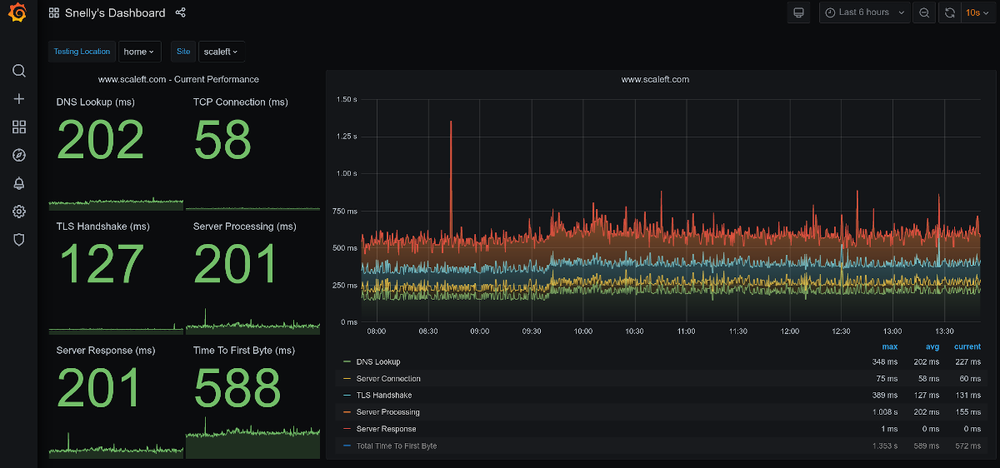
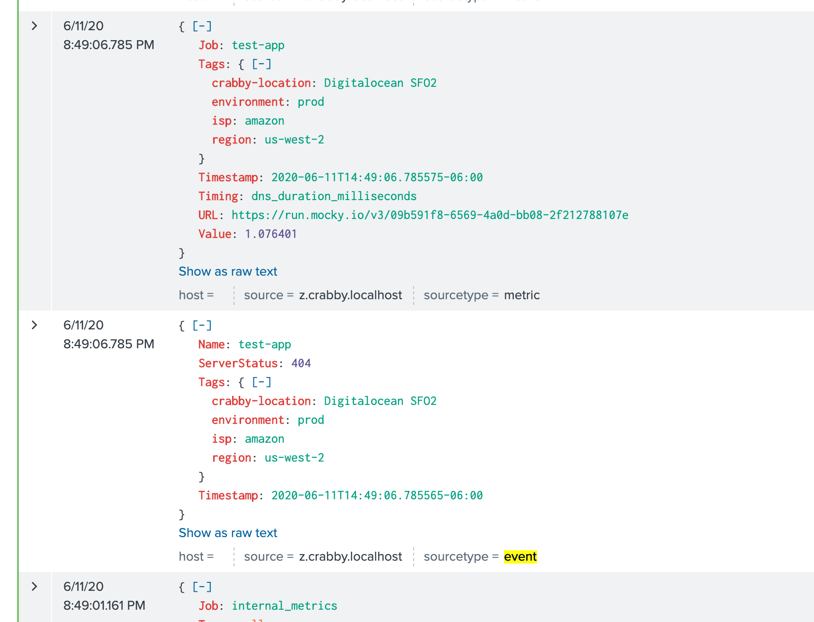
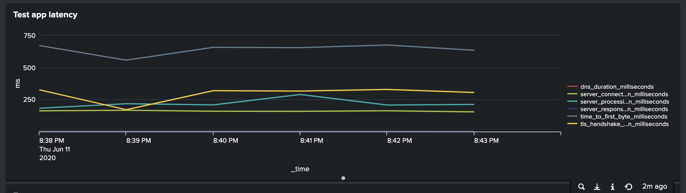
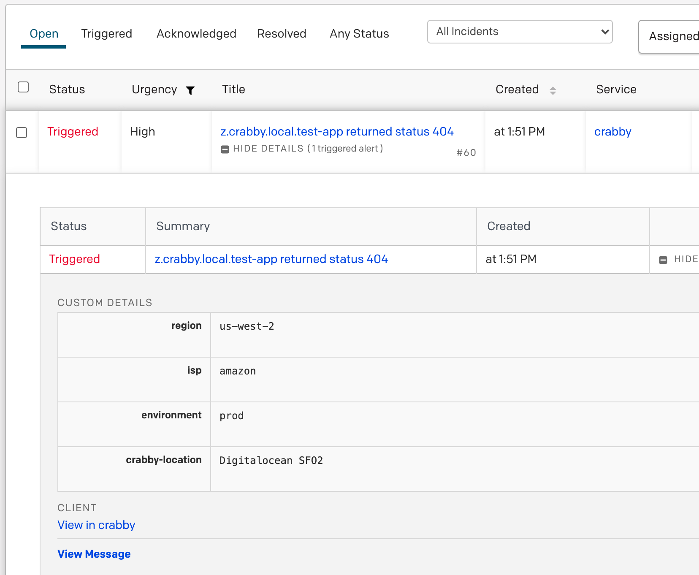

# crabby
**crabby** is a website performance tester that measures page load times and reports the measurements to a collection endpoint for processing, monitoring, and viewing.   Crabby can collect and report these metrics:

- DNS resolution time
- TCP connection time
- TLS negotiation time
- HTTP Response Code
- Remote server processing time
- Time to first byte (TTFB)
- Server response time
- DOM rendering time

Crabby currently supports these metrics delivery backends:

* **Prometheus** - Time measurements as metrics, exposed via a Prometheus endpoint
* **DogStatsD** - Time measurements as metrics via Datadog's DogStatsD protocol
* **InfluxDB** - Time measurements as metrics using the InfluxDB v2 wire protocol over HTTP
* **Splunk** - Metrics and events via Splunk HTTP Event Collector
* **PagerDuty** - Incident generation based on failed jobs via PagerDuty V2 Events API
* **Log** - Configurable flat-file or stdout logging of metrics and events

# Three Types of Performance Measuring
Crabby has three types of probes for measuring website performance:

- **`simple`** uses Go's built-in `net/http` client to conduct HTTP requests.  These requests measure server performance metrics including TLS negotiation time for HTTPS.  This probe fetches the full response for a URL but will **not** fetch objects referenced by that page.  The `simple` probe is appropriate for measuring app/API availability, time-to-first-byte (TTFB), DNS lookups, and TCP connection time.  Being headless, it cannot measure DOM rendering time.

- **`browser`** uses [chromedp](https://github.com/chromedp/chromedp) (Chrome DevTools Protocol) to conduct browser-based performance tests via a headless Chrome instance.  The `browser` probe is appropriate when page render time measurement is the primary concern.  These tests pull down the page along with all objects included in the page.

- **`api`** allows you to define multi-step API workflows with template-based response chaining.  Each step can reference values from previous steps' responses using `{{ step_name.key.nested_key }}` syntax.  This is useful for testing authenticated API flows where a token from one request must be passed to subsequent requests.

# Metrics Delivery

## Prometheus
Crabby has first-class support for Prometheus.  Crabby exposes a Prometheus endpoint that provides all gathered metrics.  The `config.yaml` in the `examples` directory will get you started.  Crabby applies global and per-job tags (if configured) as labels.

## DogStatsD
Crabby can send metrics via the DogStatsD protocol, compatible with the Datadog Agent and other DogStatsD-compatible collectors.

## InfluxDB
Crabby can send metrics to InfluxDB over HTTP/HTTPS using the InfluxDB v2 client API.  Crabby can talk to InfluxDB directly or you can stand up a Telegraf instance to relay the metrics to InfluxDB (or some other datastore).

## Splunk
Crabby supports sending metrics and events to Splunk via HTTP Event Collector. The `config.yaml` in the `examples` directory will get you started. The Splunk storage backend supports specifying the `host`, `source` and `sourceType` values for events and also to which `index` to append them.





## PagerDuty
Crabby can generate incidents based on failed jobs. Using PagerDuty's V2 Events API, Crabby will generate an incident for jobs that result in a 4xx or 5xx response code. See [CONFIGURATION.md](./CONFIGURATION.md) for details on how to configure this storage backend.



## Log
Crabby includes a configurable logging backend that can write metrics and events to stdout, stderr, or a file with customizable format strings and timestamps.

# Using Crabby
Crabby is configured by a YAML file that you pass via the `-config` flag.  If you don't pass the `-config` flag, Crabby looks for a `config.yaml` by default.  This config file defines the sites to be tested (called "jobs"), as well as the metric storage destination(s) for the metrics that are generated.  Crabby supports multiple metric storage backends _simultaneously_ so you could, for example, send metrics to InfluxDB while simultaneously making them available via the Prometheus endpoint.

For metrics storage backends that support them, Crabby supports **tags**, both _global tags_ applied to all jobs and their metrics, and _per-job tags_ that are applied to a single job's metrics.  In the event of tag name conflicts, per-job tags will override global tags.

Crabby can load secrets (API tokens, routing keys) from files instead of inlining them in config, which is useful for Kubernetes Secrets or Docker Secrets.  Use the `token-file` or `routing-key-file` config fields to point to a mounted secret file.  Crabby also sets a configurable `User-Agent` header on all HTTP requests.

## Helm Chart (Kubernetes)
The recommended way to deploy Crabby is with the included Helm chart.
Crabby includes a Helm chart for deploying to Kubernetes clusters.

### Installation
```bash
helm install crabby ./helm/crabby -f my-values.yaml
```

### Values Reference

| Key | Type | Default | Description |
|-----|------|---------|-------------|
| `replicaCount` | int | `1` | Number of replicas |
| `image.repository` | string | `ghcr.io/chrissnell/crabby` | Container image repository |
| `image.pullPolicy` | string | `IfNotPresent` | Image pull policy |
| `image.tag` | string | `""` | Image tag (defaults to chart appVersion) |
| `imagePullSecrets` | list | `[]` | Image pull secrets for private registries |
| `nameOverride` | string | `""` | Override the release name |
| `fullnameOverride` | string | `""` | Override the full release name |
| `serviceAccount.create` | bool | `true` | Create a ServiceAccount |
| `serviceAccount.annotations` | object | `{}` | Annotations for the ServiceAccount |
| `serviceAccount.name` | string | `""` | ServiceAccount name (generated if not set) |
| `serviceAccount.automount` | bool | `true` | Automount API credentials |
| `podAnnotations` | object | `{}` | Pod annotations |
| `podLabels` | object | `{}` | Pod labels |
| `podSecurityContext` | object | `{}` | Pod security context |
| `securityContext` | object | `{}` | Container security context |
| `service.type` | string | `ClusterIP` | Service type |
| `service.port` | int | `8080` | Service port (used when Prometheus storage is enabled) |
| `resources` | object | `{}` | Resource requests and limits |
| `nodeSelector` | object | `{}` | Node selector |
| `tolerations` | list | `[]` | Tolerations |
| `affinity` | object | `{}` | Affinity rules |
| `general.tags` | object | `{}` | Global tags applied to all metrics |
| `general.requestTimeout` | string | `"15s"` | HTTP request timeout (Go duration) |
| `general.reportInternalMetrics` | bool | `false` | Report internal memory/goroutine metrics |
| `general.internalMetricsGatheringInterval` | int | `15` | Internal metrics gathering interval in seconds |
| `general.userAgent` | string | `""` | Custom User-Agent header (defaults to `crabby/<version>`) |
| `browser.enabled` | bool | `false` | Enable a Chrome sidecar container for browser jobs |
| `browser.remoteUrl` | string | `""` | Chrome DevTools Protocol remote URL (auto-set if sidecar enabled) |
| `browser.headless` | bool | `true` | Run browser in headless mode |
| `browser.sidecar.image` | string | `zenika/alpine-chrome` | Chrome sidecar image |
| `browser.sidecar.tag` | string | `"latest"` | Chrome sidecar image tag |
| `browser.sidecar.resources` | object | `{}` | Chrome sidecar resource requests/limits |
| `jobs` | list | `[]` | Job definitions (see values.yaml for examples) |
| `storage.prometheus.enabled` | bool | `false` | Enable Prometheus backend |
| `storage.prometheus.listenAddr` | string | `"0.0.0.0:8080"` | Listen address inside the container |
| `storage.prometheus.metricNamespace` | string | `"crabby"` | Metric namespace prefix |
| `storage.dogstatsd.enabled` | bool | `false` | Enable DogStatsD backend |
| `storage.dogstatsd.host` | string | `"localhost"` | DogStatsD host |
| `storage.dogstatsd.port` | int | `8125` | DogStatsD port |
| `storage.dogstatsd.metricNamespace` | string | `"crabby"` | Metric namespace prefix |
| `storage.influxdb.enabled` | bool | `false` | Enable InfluxDB backend |
| `storage.influxdb.host` | string | `""` | InfluxDB HTTP(S) URL |
| `storage.influxdb.token` | string | `""` | API token (use `existingSecret` for production) |
| `storage.influxdb.org` | string | `""` | InfluxDB organization |
| `storage.influxdb.bucket` | string | `""` | InfluxDB bucket |
| `storage.influxdb.metricNamespace` | string | `"crabby"` | Metric namespace prefix |
| `storage.influxdb.existingSecret` | string | `""` | Existing Secret name (key: `influxdb-token`) |
| `storage.log.enabled` | bool | `false` | Enable log backend |
| `storage.log.file` | string | `"stdout"` | Output target: stdout, stderr, or a file path |
| `storage.splunkHec.enabled` | bool | `false` | Enable Splunk HEC backend |
| `storage.splunkHec.hecUrl` | string | `""` | HEC endpoint URL |
| `storage.splunkHec.token` | string | `""` | HEC token (use `existingSecret` for production) |
| `storage.splunkHec.existingSecret` | string | `""` | Existing Secret name (key: `splunk-hec-token`) |
| `storage.pagerduty.enabled` | bool | `false` | Enable PagerDuty backend |
| `storage.pagerduty.routingKey` | string | `""` | Integration routing key (use `existingSecret` for production) |
| `storage.pagerduty.existingSecret` | string | `""` | Existing Secret name (key: `pagerduty-routing-key`) |
| `serviceMonitor.enabled` | bool | `false` | Create a ServiceMonitor resource (Prometheus Operator) |
| `serviceMonitor.labels` | object | `{}` | Additional labels for the ServiceMonitor |
| `serviceMonitor.interval` | string | `""` | Scrape interval |
| `serviceMonitor.scrapeTimeout` | string | `""` | Scrape timeout |
| `extraEnv` | list | `[]` | Extra environment variables |
| `extraVolumes` | list | `[]` | Extra volumes to mount |
| `extraVolumeMounts` | list | `[]` | Extra volume mounts |

## Docker
A multi-stage `Dockerfile` is included in the repo.  There's also a `docker-compose.yml` in the [example/](https://github.com/chrissnell/crabby/tree/master/example) directory to get you started.

To use Crabby in Docker, mount your `config.yaml` configuration file into the container and set the `CRABBY_CONFIG` environment variable to the location where you mounted it.  The Docker Compose example handles this for you.

## Binaries
If you prefer, [binaries are available](https://github.com/chrissnell/crabby/releases) on the Releases page for a variety of architectures.  After downloading the release, you can snag the `config.yaml` from the [example/](https://github.com/chrissnell/crabby/tree/master/example) directory to get started.

# Crabby Configuration
Crabby is configured by a YAML file that you pass via the `-config` flag (defaults to `config.yaml`).
See [CONFIGURATION.md](/CONFIGURATION.md) for a detailed description of this file.  There is also [an example](/example/config.yaml), if you need one.
